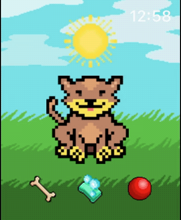
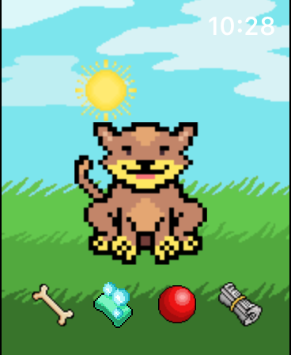
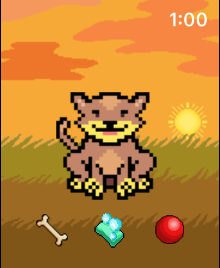
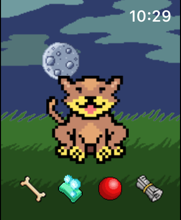

#  WristBuddy

 &nbsp;  &nbsp;  &nbsp; 

WristBuddy is a tiny tamagotchi-like companion for Apple Watch.
Built in Swift and SceneKit, with no external libraries.

* Built-in news reader (data-source: ANSA Breaking News RSS feed - Italian language)
* Features more than 50 frames of animation and a full day/night cycle
* Provides touch points conversion from global coordinates to nodes' anchors
