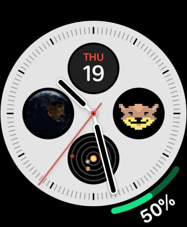
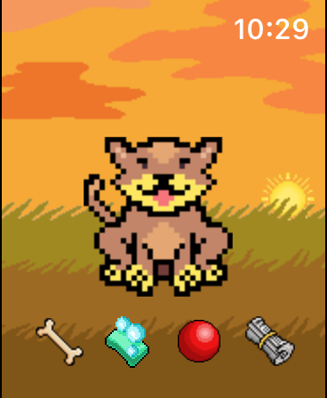

#  WristBuddy

 &nbsp;  &nbsp;  &nbsp; 

WristBuddy is a tiny tamagotchi-like companion for Apple Watch.
Built in Swift and SceneKit, with no external libraries.

* Features around 50 frames of animation and a full day/night cycle
* Provides touch points conversion from global coordinates to nodes' anchors
* Works on both 40mm and 44mm Watch
